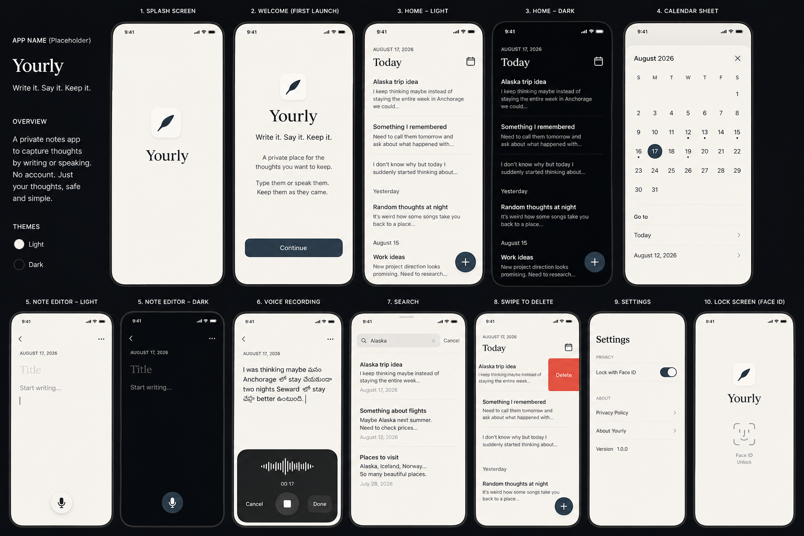

# Design Reference

Canonical visual reference for **[AppName]** V1.

`screens-overview.png` is a single 10-screen mockup and the **canonical visual target** for look and
feel. When pixels and prose disagree: match this reference for **visual intent**, and defer to the
specs + `../../RULES.md` for **behavior**. Full design rules live in `../03-design-system.md`
(see its §0). The reference uses **"Yourly"** with a feather/quill mark as the placeholder brand — the
product name is still `[AppName]` (see `../../CLAUDE.md`).

## Layout of the sheet

The image is two rows of device frames:

- **Top row:** 1 Splash · 2 Welcome · 3 Home (Light) · 3 Home (Dark) · 4 Calendar sheet
- **Bottom row:** 5 Editor (Light) · 5 Editor (Dark) · 6 Voice recording · 7 Search · 8 Swipe to delete · 9 Settings · 10 Lock screen
- **Far-left column:** a legend — `APP NAME (Placeholder)`, the **Yourly** wordmark, tagline, an
  Overview blurb, and a Themes swatch (Light / Dark).

---

## Screen-by-screen

### 1. Splash
Feather/quill mark in a soft rounded-square app tile, centered, with the serif **Yourly** wordmark
below. No button, no progress spinner. Background matches the first rendered app background to avoid a
flash. → `../03-design-system.md` §4.1.

### 2. Welcome (first launch)
Bare feather mark → serif **Yourly** wordmark → tagline **"Write it. Say it. Keep it."** → short
explanation ("A private place for the thoughts you want to keep. Type them or speak them. Keep them as
they came.") → single dark-navy **Continue** button low on the screen. No permission prompts, no
account. Shown once. → §4.2.

### 3. Home — Light & Dark
Identical layout in both themes:
- Small uppercase date (`AUGUST 17, 2026`), prominent **Today**, calendar glyph aligned opposite.
- Chromeless note rows (no cards): title + 2–3 line preview, separated by whitespace.
- Day-group headers (`Yesterday`, `August 15`) between sections.
- Filled dark-navy floating **`+`** bottom-right.
- No timestamps on rows. Light = warm off-white canvas; Dark = near-black canvas. → §4.3, §5.

### 4. Calendar sheet
Native sheet: month title (`August 2026`) + close `✕`; weekday header row; month grid where days with
notes carry a small dot and the selected day (17) is a filled accent circle. Below the grid a **Go to**
list: `Today` and the most recent note date (`August 12, 2026`), each a tappable row. No heatmap, no
counts. → §4.6, `../02-features.md` (Calendar).

### 5. Note editor — Light & Dark
Back chevron + overflow `···` top bar; secondary date label; **`Title`** placeholder (no box);
**`Start writing…`** body placeholder with caret; mic control at the bottom. No toolbar, no Save, no
word count. → §4.7.

### 6. Voice recording
Editor stays visible with the live transcript inline — shown here as genuine Telugu+English
code-switching:
> "I was thinking maybe మనం Anchorage లో stay చేయుండా two nights Seward లో stay చేసు better ఉంటుంది."

A dark system-material panel rises from the bottom with a waveform, elapsed time (`00:17`), and
**Cancel** / stop / **Done**. This is the only dark surface over content; the writing plane stays
solid. The transcript demonstrates the verbatim-capture contract (no translation/rewrite) —
`../../RULES.md` §2. → §4.8.

### 7. Search
Native search field (`Alaska`) with clear `✕` and **Cancel**. Results are title + preview + date
(dates appear in search even though Home rows omit them). Lexical match over title/body. → §4.5,
`../02-features.md` (Search).

### 8. Swipe to delete
Left-swipe on a Home row reveals a native red **Delete** action. Deletion is immediate on Home and
reversible via a brief Undo (soft delete under the hood). → §4.10, `../05-architecture.md` §12.

### 9. Settings
`Settings` title. **PRIVACY** section: `Lock with Face ID` toggle. **ABOUT** section: `Privacy Policy`,
`About [AppName]`, `Version 1.0.0`. No appearance selector — theme follows the system. → §4.11.

### 10. Lock screen (Face ID)
Minimal: feather mark, serif **Yourly** wordmark, Face ID glyph, and an **Unlock** affordance. No
readable note text behind it. → §4.12, `../05-architecture.md` §18.

---

## Colors read from the reference

Visual reads only — the tokens in `../03-design-system.md` §5.2 are authoritative.

| Role | Light | Dark |
|---|---|---|
| Canvas | warm off-white | near-black |
| Text primary | near-black | warm off-white |
| Accent (Continue, floating `+`, selected day) | dark navy | dark navy |
| Destructive (swipe Delete) | iOS system red | iOS system red |

## Brand assets

- **Mark:** feather/quill glyph — app tile on Splash; bare glyph on Welcome/Lock.
- **Wordmark:** serif **Yourly** logotype — Splash, Welcome, Lock only.
- **Not a UI font.** All in-app text uses system San Francisco + Dynamic Type. The serif is a logotype
  asset only. See `../../RULES.md` §4 and `../03-design-system.md` §0.
